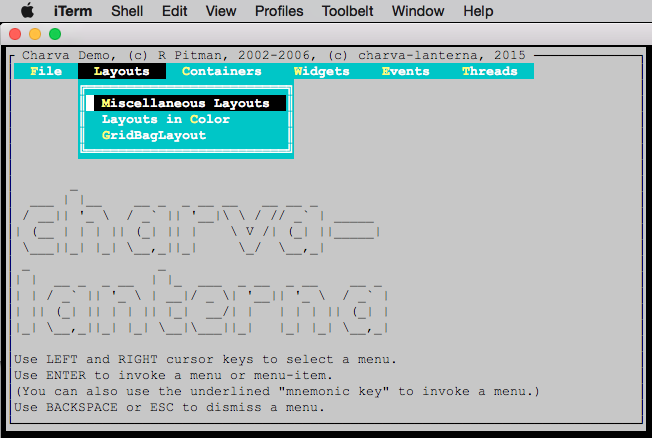

charva-lanterna
===============
[](https://travis-ci.org/viktor-podzigun/charva-lanterna)

Making [CHARVA UI](http://sourceforge.net/projects/charva/) 100% Java by using [lanterna terminal](https://github.com/mabe02/lanterna) library

### Build
```bash
mvn clean package
```

### Run Demo 
```bash
java -Djava.awt.headless=true -jar ./charva-demo-app/target/charva-demo.jar
```


### Changes to the original CHARVA UI project

There was some refactoring of original Charva code done. Most of the changes were done to the
internal code and should not break client/API interface much.

The idea of these changes is to make the Charva as close to Swing as possible. From both,
the client/API side, and the internal side. To make it easier to support/migrate the components
in the future.

Here are the list of the changes:

1. Structure/modules changes

2. Code changes

3. New/Added staff

    draw method for each component
    renaming it to paint
    adding Graphics class
    adding plaf package to follow javax.swing structure
    making other changes


### How to track the beginning of charva-lanterna back to CHARVA UI

As of 20th March 2016, the original repository of [CHARVA
UI](http://sourceforge.net/projects/charva/) hosts two branches:

* `trunk` r95 - last updated in 2007. A copy of that branch is stored
  in `refs/tags/sourceforge-svn-trunk-r95`;

* Branch `andxor` r116 - last updated in 2009. A copy of that branch
  is stored in tag `refs/tags/sourceforge-svn-branch-andxor-r116`.

charva-lanterna started in 2015, importing a modified version of
CHARVA UI `trunk` r95 - see charva-lanterna commit f5d7b75 `Added
charva, charva-showcase, charva-lanterna modules`.  In order to enrich
the charva-lanterna repository history with CHARVA UI's one, you can
use `git replace`:
```bash
git checkout refs/tags/sourceforge-svn-trunk-r95
git cherry-pick $(git rev-list master | tail -1)
git replace $(git rev-list master | tail -1) HEAD
```
